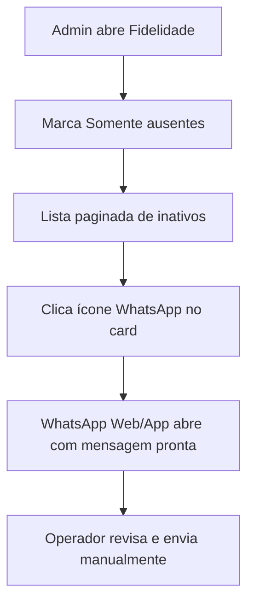

# WhatsApp Manual — Reativação de Clientes Ausentes Implementation Plan

> **For agentic workers:** REQUIRED SUB-SKILL: Use superpowers:subagent-driven-development (recommended) or superpowers:executing-plans to implement this plan task-by-task. Steps use checkbox (`- [ ]`) syntax for tracking.

**Goal:** Permitir que o admin envie manualmente, via links `wa.me`, uma mensagem padrão de reativação para clientes de fidelidade ausentes há mais de 3 dias — sem API paga, sem automação em background.

**Architecture:** Reutiliza a lógica existente `isInactiveVisit()` no backend para filtrar clientes. A mensagem padrão fica em `loyalty_settings.reactivation_message` (persistida no banco). O frontend monta URLs `https://wa.me/55{telefone}?text={mensagem}` com placeholders `{{nome}}` e `{{dias}}`, abrindo o WhatsApp Business do operador. Cada envio é manual (clique no botão).

**Tech Stack:** Node/Express, PostgreSQL, HTML/JS admin vanilla (`admin.html`, `js/admin/loyalty.js`, `js/database.js`, `css/admin.css`). Testes: script `node scripts/test-whatsapp-links.js` para helpers puros; resto verificado manualmente no navegador.

## Global Constraints

- **Sem API WhatsApp** — nenhuma integração Cloud API, Z-API, webhook ou cron.
- **Sem log de envios** — não criar tabela `loyalty_message_log` nesta fase (YAGNI).
- **Limiar de inatividade** permanece `INACTIVE_VISIT_DAYS = 3` em `routes/loyaltyHelpers.js` (não configurável nesta fase).
- **Telefone BR** — prefixo `55` + 10–11 dígitos (`normalizePhone()` existente).
- **Permissões** — endpoints novos/alterados usam `requireAnyPermission('fidelidade', 'vendas')` ou `requirePermission('fidelidade')`, igual ao restante do módulo.
- **Mensagem padrão sugerida:** `Olá {{nome}}, sentimos sua falta no FitPoint! Já faz {{dias}} dias que não te vemos. Que tal voltar hoje? 💪`

---

## File Structure

| Arquivo | Papel |
|---------|-------|
| `config/database.js` | Coluna `reactivation_message TEXT` em `loyalty_settings` |
| `routes/loyaltyHelpers.js` | Exporta `INACTIVE_VISIT_DAYS`, `buildInactiveVisitSqlClause()`, helpers de mensagem/WhatsApp |
| `routes/loyalty.js` | `GET/PUT settings` incluem `reactivation_message`; `GET /customers` aceita `inactive_only=1` |
| `js/database.js` | Repassa `reactivation_message` e `inactive_only` nos métodos de fidelidade |
| `js/admin/loyalty.js` | Template, filtro "Somente ausentes", botão WhatsApp no card, contador |
| `admin.html` | Textarea da mensagem padrão + checkbox de filtro |
| `css/admin.css` | Estilos do botão WhatsApp e toolbar de reativação |
| `scripts/test-whatsapp-links.js` | Testes dos helpers de URL e substituição de placeholders |

---

### Task 1: Helpers de mensagem e URL WhatsApp

**Files:**
- Modify: `routes/loyaltyHelpers.js`
- Create: `scripts/test-whatsapp-links.js`

**Interfaces:**
- Produces (consumidas pelas Tasks 2–3):
  - `INACTIVE_VISIT_DAYS` — exportar constante existente (valor `3`)
  - `buildInactiveVisitSqlClause(alias = '') → { clause: string }` — fragmento SQL `AND (...)` espelhando `isInactiveVisit()`
  - `formatPhoneForWhatsApp(phone) → string | null` — `'5511999998888'` ou `null` se inválido
  - `applyReactivationTemplate(template, { name, days }) → string` — substitui `{{nome}}` e `{{dias}}`
  - `buildWhatsAppUrl(phone, message) → string | null` — `'https://wa.me/5511...?text=...'`

- [ ] **Step 1: Exportar constante e SQL de inatividade**

Em `routes/loyaltyHelpers.js`, após `INACTIVE_VISIT_DAYS`, adicionar:

```js
function buildInactiveVisitSqlClause(alias = '') {
  const col = alias ? `${alias}.` : '';
  return {
    clause: ` AND (
      (${col}last_positive_visit_at IS NOT NULL
        AND ${col}last_positive_visit_at < NOW() - INTERVAL '${INACTIVE_VISIT_DAYS} days')
      OR (${col}last_positive_visit_at IS NULL AND COALESCE(${col}total_visits, 0) > 0)
    )`
  };
}
```

No `module.exports` do arquivo, incluir `INACTIVE_VISIT_DAYS` e `buildInactiveVisitSqlClause`.

- [ ] **Step 2: Adicionar helpers de mensagem e URL**

Logo após `normalizePhone`, adicionar:

```js
const DEFAULT_REACTIVATION_MESSAGE =
  'Olá {{nome}}, sentimos sua falta no FitPoint! Já faz {{dias}} dias que não te vemos. Que tal voltar hoje? 💪';

function formatPhoneForWhatsApp(phone) {
  const digits = normalizePhone(phone);
  if (digits.length < 10 || digits.length > 11) return null;
  return `55${digits}`;
}

function applyReactivationTemplate(template, { name = 'Cliente', days = 3 } = {}) {
  const safeName = String(name || 'Cliente').trim() || 'Cliente';
  const safeDays = Math.max(0, Math.trunc(Number(days) || 0));
  return String(template || DEFAULT_REACTIVATION_MESSAGE)
    .replace(/\{\{nome\}\}/gi, safeName)
    .replace(/\{\{dias\}\}/gi, String(safeDays));
}

function buildWhatsAppUrl(phone, message) {
  const waPhone = formatPhoneForWhatsApp(phone);
  if (!waPhone) return null;
  const text = encodeURIComponent(String(message || '').trim());
  if (!text) return `https://wa.me/${waPhone}`;
  return `https://wa.me/${waPhone}?text=${text}`;
}
```

Exportar: `DEFAULT_REACTIVATION_MESSAGE`, `formatPhoneForWhatsApp`, `applyReactivationTemplate`, `buildWhatsAppUrl`.

- [ ] **Step 3: Criar script de teste**

Criar `scripts/test-whatsapp-links.js`:

```js
const {
  formatPhoneForWhatsApp,
  applyReactivationTemplate,
  buildWhatsAppUrl,
  DEFAULT_REACTIVATION_MESSAGE
} = require('../routes/loyaltyHelpers');

function assert(cond, msg) {
  if (!cond) throw new Error(msg);
}

assert(formatPhoneForWhatsApp('(11) 99999-8888') === '5511999998888', 'celular com máscara');
assert(formatPhoneForWhatsApp('1133334444') === '551133334444', 'fixo 10 dígitos');
assert(formatPhoneForWhatsApp('123') === null, 'telefone curto');

const msg = applyReactivationTemplate(DEFAULT_REACTIVATION_MESSAGE, { name: 'Maria', days: 5 });
assert(msg.includes('Maria'), 'substitui nome');
assert(msg.includes('5'), 'substitui dias');

const url = buildWhatsAppUrl('11999998888', msg);
assert(url.startsWith('https://wa.me/5511999998888?text='), 'monta URL wa.me');
assert(decodeURIComponent(url.split('text=')[1]).includes('Maria'), 'texto codificado');

console.log('OK — test-whatsapp-links');
```

- [ ] **Step 4: Rodar teste**

Run: `node scripts/test-whatsapp-links.js`  
Expected: `OK — test-whatsapp-links`

- [ ] **Step 5: Commit**

```bash
git add routes/loyaltyHelpers.js scripts/test-whatsapp-links.js
git commit -m "feat(loyalty): helpers de URL WhatsApp e template de reativação"
```

---

### Task 2: Persistir mensagem padrão + filtro `inactive_only` na API

**Files:**
- Modify: `config/database.js`
- Modify: `routes/loyalty.js`
- Modify: `js/database.js`

**Interfaces:**
- Consumes: `buildInactiveVisitSqlClause`, `DEFAULT_REACTIVATION_MESSAGE` de Task 1
- Produces:
  - `GET /api/loyalty/settings` → `{ visits_per_reward, access_value, reactivation_message }`
  - `PUT /api/loyalty/settings` → aceita `reactivation_message` (string, max 500 chars)
  - `GET /api/loyalty/customers?inactive_only=1` → só clientes com `inactive_visit = true`

- [ ] **Step 1: Migração da coluna**

Em `config/database.js`, após o `ALTER TABLE ... access_value`, adicionar:

```js
    await client.query(`
      ALTER TABLE ${SCHEMA}.loyalty_settings
      ADD COLUMN IF NOT EXISTS reactivation_message TEXT
    `);
```

- [ ] **Step 2: Atualizar `getLoyaltySettings` em `routes/loyalty.js`**

Alterar o `SELECT` para incluir `reactivation_message` e retornar no objeto:

```js
reactivation_message: row.reactivation_message?.trim() || DEFAULT_REACTIVATION_MESSAGE
```

Importar `DEFAULT_REACTIVATION_MESSAGE` e `buildInactiveVisitSqlClause` de `loyaltyHelpers`.

- [ ] **Step 3: Atualizar `PUT /settings`**

Aceitar `reactivation_message` opcional:

```js
const rawMessage = req.body?.reactivation_message;
let reactivationMessage = DEFAULT_REACTIVATION_MESSAGE;
if (rawMessage != null) {
  const trimmed = String(rawMessage).trim();
  if (trimmed.length > 500) {
    return res.status(400).json({ error: 'Mensagem de reativação deve ter no máximo 500 caracteres.' });
  }
  reactivationMessage = trimmed || DEFAULT_REACTIVATION_MESSAGE;
}
```

Incluir `reactivation_message` no `INSERT ... ON CONFLICT` e na resposta JSON.

- [ ] **Step 4: Filtro `inactive_only` em `GET /customers`**

Após montar `baseWhere`, ler query param:

```js
const inactiveOnly = ['1', 'true', 'yes'].includes(String(req.query.inactive_only || '').toLowerCase());
const inactiveClause = inactiveOnly ? buildInactiveVisitSqlClause().clause : '';
const baseWhere = `WHERE 1=1${searchPart.clause}${activeClause}${inactiveClause}`;
```

- [ ] **Step 5: Atualizar `js/database.js`**

Em `getLoyaltyCustomers`, repassar filtro:

```js
if (params.inactive_only != null) {
  qs.set('inactive_only', params.inactive_only === true || params.inactive_only === 'true' ? 'true' : String(params.inactive_only));
}
```

`updateLoyaltySettings` já envia o objeto inteiro — nenhuma mudança estrutural necessária além de incluir `reactivation_message` no payload do admin (Task 3).

- [ ] **Step 6: Reiniciar servidor e smoke test**

Run: `node scripts/test-whatsapp-links.js` (deve continuar passando)

Teste manual com curl ou navegador logado:
- `GET /api/loyalty/settings` retorna `reactivation_message`
- `GET /api/loyalty/customers?inactive_only=true&limit=5` retorna só ausentes

- [ ] **Step 7: Commit**

```bash
git add config/database.js routes/loyalty.js js/database.js
git commit -m "feat(loyalty): mensagem de reativação e filtro inactive_only na API"
```

---

### Task 3: UI admin — configuração, filtro e botão WhatsApp

**Files:**
- Modify: `admin.html`
- Modify: `js/admin/loyalty.js`
- Modify: `css/admin.css`

**Interfaces:**
- Consumes: `DB.getLoyaltySettings()`, `DB.updateLoyaltySettings()`, `DB.getLoyaltyCustomers({ inactive_only })`
- Produces (funções globais usadas no HTML):
  - `buildLoyaltyWhatsAppUrl(customer) → string | null`
  - `openLoyaltyWhatsApp(customer) → void` — `window.open(url, '_blank')`
  - `toggleLoyaltyInactiveFilter()` — alterna filtro e recarrega lista
  - Variável `loyaltyReactivationMessage` — template carregado das settings
  - Variável `loyaltyInactiveOnly` — boolean do filtro

- [ ] **Step 1: Textarea de mensagem em `admin.html`**

Dentro do card "Configuração do programa" (após o bloco de valor de acesso), adicionar:

```html
<div class="mt-3 w-full max-w-xl">
  <label class="text-xs text-black/60 block mb-1" for="loyalty-reactivation-message">
    Mensagem WhatsApp (clientes ausentes)
  </label>
  <textarea id="loyalty-reactivation-message" rows="3" maxlength="500"
    class="w-full text-sm"
    placeholder="Use {{nome}} e {{dias}} como placeholders"></textarea>
  <p class="text-xs text-black/50 mt-1">
    Variáveis: <code>{{nome}}</code> = nome do cliente, <code>{{dias}}</code> = dias ausente.
    O envio abre o WhatsApp Business manualmente — não há cobrança de API.
  </p>
</div>
```

- [ ] **Step 2: Checkbox de filtro acima da lista**

Em `#loyalty-tab-customers`, dentro da `div.mb-3` que contém `#loyalty-search`, adicionar:

```html
<label class="inline-flex items-center gap-2 text-sm text-black/70 mt-2 cursor-pointer">
  <input type="checkbox" id="loyalty-inactive-only" onchange="toggleLoyaltyInactiveFilter()">
  Somente ausentes (3+ dias)
</label>
<span id="loyalty-inactive-count" class="text-xs text-black/50 ml-2 hidden"></span>
```

- [ ] **Step 3: Estado e helpers em `js/admin/loyalty.js`**

No topo do arquivo, adicionar:

```js
let loyaltyReactivationMessage = '';
let loyaltyInactiveOnly = false;
```

Em `loadLoyaltySettings`, após carregar `access_value`:

```js
loyaltyReactivationMessage = settings.reactivation_message || '';
const msgInput = document.getElementById('loyalty-reactivation-message');
if (msgInput) msgInput.value = loyaltyReactivationMessage;
```

Em `saveLoyaltySettings`, incluir no payload:

```js
const msgInput = document.getElementById('loyalty-reactivation-message');
const reactivation_message = msgInput?.value.trim() || '';
// ...
await DB.updateLoyaltySettings({
  visits_per_reward: value,
  access_value: Math.round(accessValue * 100) / 100,
  reactivation_message
});
loyaltyReactivationMessage = reactivation_message;
```

Adicionar funções (podem espelhar a lógica de `loyaltyHelpers` no client — duplicação mínima intencional para evitar bundler):

```js
function buildLoyaltyWhatsAppUrl(customer) {
  const digits = normalizePhoneDigits(customer.phone || '');
  if (digits.length < 10) return null;
  const days = getInactiveVisitDays(customer) ?? 3;
  const template = loyaltyReactivationMessage ||
    'Olá {{nome}}, sentimos sua falta no FitPoint! Já faz {{dias}} dias que não te vemos. Que tal voltar hoje? 💪';
  const message = template
    .replace(/\{\{nome\}\}/gi, (customer.name || 'Cliente').trim() || 'Cliente')
    .replace(/\{\{dias\}\}/gi, String(Math.max(0, days)));
  return `https://wa.me/55${digits}?text=${encodeURIComponent(message)}`;
}

function openLoyaltyWhatsApp(customer) {
  const url = buildLoyaltyWhatsAppUrl(customer);
  if (!url) {
    showToast('Telefone inválido para WhatsApp.', 'error');
    return;
  }
  window.open(url, '_blank', 'noopener,noreferrer');
}

function toggleLoyaltyInactiveFilter() {
  const cb = document.getElementById('loyalty-inactive-only');
  loyaltyInactiveOnly = !!cb?.checked;
  loyaltyPage = 1;
  loadLoyaltyCustomers();
}
```

Em `loadLoyaltyCustomers`, passar filtro:

```js
const data = await DB.getLoyaltyCustomers({
  q: loyaltySearch || undefined,
  page: loyaltyPage,
  limit: loyaltyLimit,
  inactive_only: loyaltyInactiveOnly || undefined
});
```

Atualizar contador (quando filtro ativo, `data.total` já é a contagem):

```js
const countEl = document.getElementById('loyalty-inactive-count');
if (countEl) {
  if (loyaltyInactiveOnly && data.total > 0) {
    countEl.textContent = `${data.total} cliente${data.total === 1 ? '' : 's'} ausente${data.total === 1 ? '' : 's'}`;
    countEl.classList.remove('hidden');
  } else {
    countEl.classList.add('hidden');
  }
}
```

- [ ] **Step 4: Botão WhatsApp no card de cliente ausente**

Em `renderLoyaltyCustomerCard`, dentro de `.loyalty-card-actions` (antes do botão de histórico), adicionar condicionalmente:

```js
const whatsappBtn = c.inactive_visit
  ? `<button type="button" onclick="openLoyaltyWhatsApp(${JSON.stringify({ id: c.id, name: c.name, phone: c.phone, last_positive_visit_at: c.last_positive_visit_at, inactive_visit: c.inactive_visit }).replace(/"/g, '&quot;')})" class="btn btn-outline btn-sm btn-icon loyalty-whatsapp-btn" title="Enviar WhatsApp de reativação">
       <i data-lucide="message-circle"></i>
     </button>`
  : '';
```

**Nota:** preferir passar só o `id` e buscar do cache, ou usar `onclick="openLoyaltyWhatsAppById(${c.id})"` para evitar JSON inline. Implementação recomendada:

```js
function openLoyaltyWhatsAppById(id) {
  const card = document.querySelector(`[data-loyalty-id="${id}"]`);
  // Alternativa mais limpa: guardar último array `loyaltyCustomersCache` ao carregar
}
```

**Implementação limpa:** manter `let loyaltyCustomersCache = []` preenchido em `loadLoyaltyCustomers`, e:

```js
function openLoyaltyWhatsAppById(id) {
  const customer = loyaltyCustomersCache.find(c => c.id === id);
  if (!customer) return;
  openLoyaltyWhatsApp(customer);
}
```

Botão: `onclick="openLoyaltyWhatsAppById(${c.id})"`.

- [ ] **Step 5: Estilos em `css/admin.css`**

```css
.loyalty-whatsapp-btn {
  color: #128c7e;
  border-color: rgba(18, 140, 126, 0.35);
}
.loyalty-whatsapp-btn:hover {
  background: rgba(18, 140, 126, 0.08);
  border-color: #128c7e;
}
#loyalty-reactivation-message {
  resize: vertical;
  min-height: 4.5rem;
}
```

- [ ] **Step 6: Teste manual no navegador**

1. Abrir `http://localhost:3000/admin.html` → Fidelidade
2. Rodar `node scripts/seed-inactive-loyalty-customer.js` se não houver ausente
3. Marcar "Somente ausentes" → lista filtra
4. Clicar ícone WhatsApp no card → abre `wa.me` com mensagem personalizada
5. Editar template, salvar, reabrir link → texto atualizado
6. Cliente com telefone inválido → toast de erro

- [ ] **Step 7: Commit**

```bash
git add admin.html js/admin/loyalty.js css/admin.css
git commit -m "feat(admin): WhatsApp manual para clientes ausentes na fidelidade"
```

---

### Task 4 (opcional): Atalho "Copiar link" no card

**Files:**
- Modify: `js/admin/loyalty.js`

**Interfaces:**
- Consumes: `buildLoyaltyWhatsAppUrl(customer)` de Task 3

- [ ] **Step 1: Função copiar**

```js
async function copyLoyaltyWhatsAppLink(id) {
  const customer = loyaltyCustomersCache.find(c => c.id === id);
  const url = customer ? buildLoyaltyWhatsAppUrl(customer) : null;
  if (!url) {
    showToast('Telefone inválido.', 'error');
    return;
  }
  try {
    await navigator.clipboard.writeText(url);
    showToast('Link copiado!', 'success');
  } catch {
    showToast('Não foi possível copiar.', 'error');
  }
}
```

- [ ] **Step 2: Botão secundário no card** (ícone `link` ou menu contextual)

- [ ] **Step 3: Teste manual** — copiar e colar no navegador mobile

- [ ] **Step 4: Commit**

```bash
git commit -m "feat(admin): copiar link WhatsApp de reativação"
```

---

## Fluxo do operador (pós-implementação)



---

## Test plan resumido

| Cenário | Resultado esperado |
|---------|-------------------|
| Cliente ausente há 4 dias | Aparece com badge + botão WhatsApp |
| Cliente visitou ontem | Sem botão WhatsApp |
| Filtro "Somente ausentes" | API retorna só `inactive_visit=true` |
| Template com `{{nome}}` e `{{dias}}` | Substituídos corretamente na URL |
| Telefone 10 ou 11 dígitos | URL `wa.me/55...` válida |
| Telefone inválido | Toast de erro, sem abrir janela |
| Salvar mensagem vazia | Backend usa default |
| Mensagem > 500 chars | Erro 400 ao salvar |

---

## Fora de escopo (fases futuras)

- Envio automático (cron + Cloud API / Z-API)
- Log de mensagens enviadas
- Prazo de inatividade configurável no admin
- Opt-in LGPD no cadastro
- Tab dedicada "Reativação" com envio em lote automático

---

## Spec self-review

- [x] Cobre filtro, template, botão wa.me e testes — requisitos da Opção A
- [x] Sem placeholders TBD
- [x] Assinaturas consistentes entre tasks (`buildInactiveVisitSqlClause`, `buildLoyaltyWhatsAppUrl`)
- [x] Escopo único e implementável em ~1–2 dias
